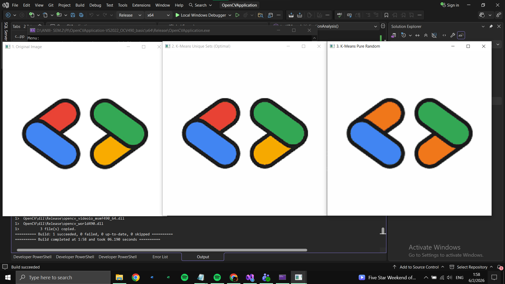
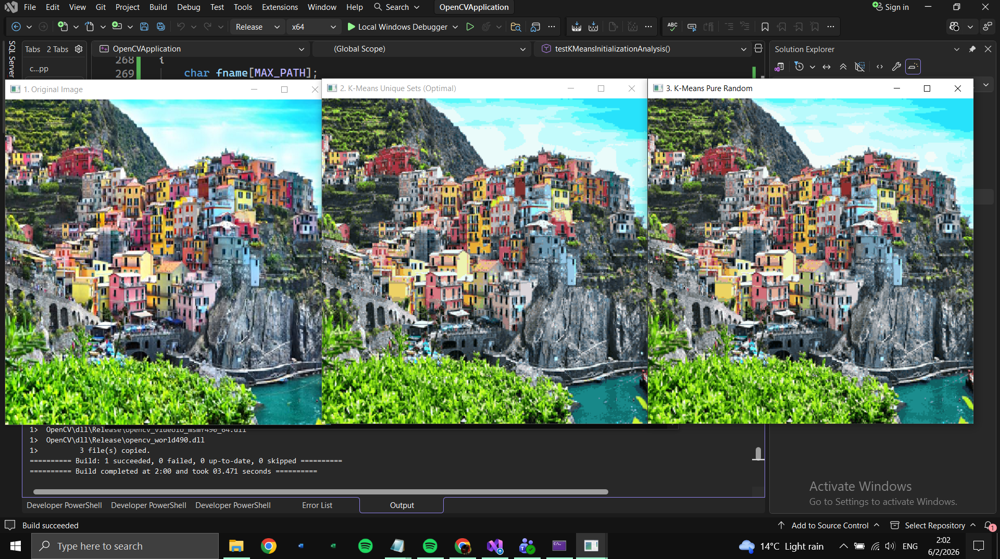
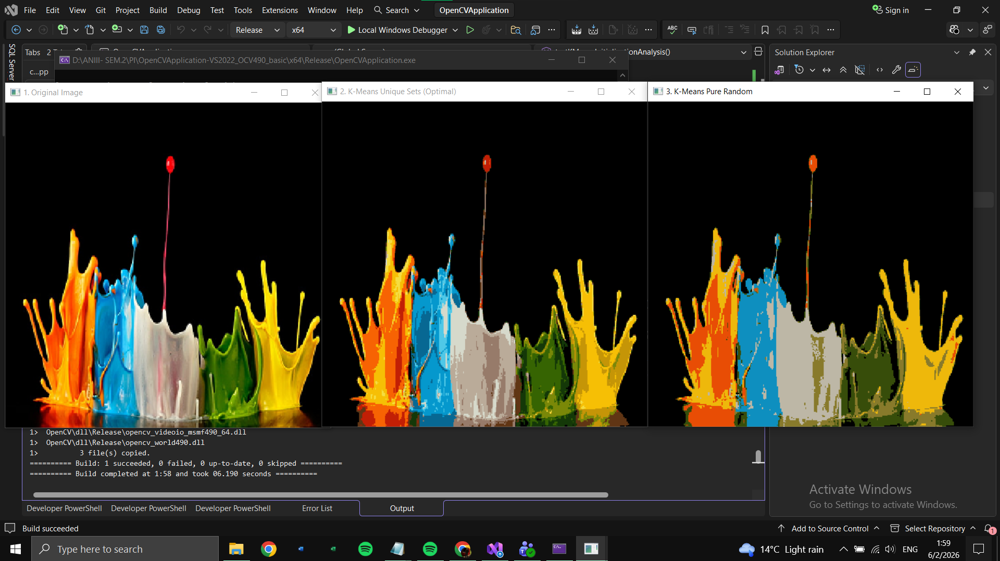
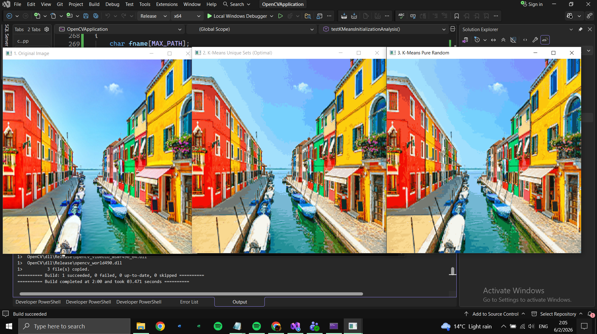

# Color Quantization — K-Means & Median Cut Algorithms

Image processing project implemented in C++ using OpenCV. The project compares two classic color quantization algorithms — K-Means Clustering and the Median Cut Algorithm — analyzing both their visual output quality and their performance.

---

## Table of Contents

- [About the Project](#about-the-project)
- [Key Concepts & Definitions](#key-concepts--definitions)
- [High-Level Architecture](#high-level-architecture)
- [Visual Results & Comparisons](#visual-results--comparisons)
- [Performance Results](#performance-results)
- [Conclusions](#conclusions)
- [Tech Stack](#tech-stack)
- [User Manual](#user-manual)
- [Installation & Setup](#installation--setup)
- [References](#references)
- [Author](#author)

---

## About the Project

### What is Color Quantization?

Color quantization reduces the number of distinct colors in an image while preserving its visual appearance as much as possible. This project implements two classic approaches:

- **K-Means Clustering** (with two centroid initialization strategies: Unique and Random)
- **Median Cut Algorithm**

### Input / Output / Constraints

| | |
|---|---|
| **Input** | RGB color image (any size), K = number of desired colors |
| **Output** | Quantized image with at most K colors |
| **Constraints** | K ≥ 1 and K ≤ number of unique colors in the image. The image is resized to 300×300 for speed. |

---

## Key Concepts & Definitions

| Term | Definition |
|---|---|
| **Centroid** | The representative color of a cluster — computed as the mean of all pixel colors assigned to it. |
| **Cluster** | A group of pixels sharing a common representative color after quantization. |
| **Euclidean Distance** | Distance in 3D color space: `√((B₁-B₂)² + (G₁-G₂)² + (R₁-R₂)²)`. Used to find the nearest centroid. |
| **Median Cut Box** | A sub-range of color space, split along its longest channel axis at the median pixel. |
| **Convergence** | K-Means stops when all centroid movements between iterations are ≤ 1.0 in Euclidean distance. |

---

## High-Level Architecture

The application resizes the input image to 300×300, then routes it through one of the two quantization pipelines below.

```
                        ┌────────────────────┐
                        │   Input Image       │
                        └─────────┬───────────┘
                                  │
                        ┌─────────▼───────────┐
                        │  Resize to 300×300   │
                        └─────────┬───────────┘
                 ┌────────────────┴────────────────┐
                 ▼                                  ▼
     ┌───────────────────────┐          ┌───────────────────────┐
     │  K-Means Quantization  │          │ Median Cut Quantization │
     └───────────┬───────────┘          └───────────┬───────────┘
                 ▼                                  ▼
        Quantized Output Image              Quantized Output Image
```

**Main Modules**

- `kMeansColorQuantization()`
- `initializeCentroidsUnique()` / `initializeCentroidsRandom()`
- `testKMeansInitializationAnalysis()` — menu option `200`
- `medianCutColorQuantization()`
- `countUniqueColors()`
- `runPerformanceComparison()` — menu option `201`

---

## Visual Results & Comparisons

### K-Means: Unique Sets vs. Random Initialization

| Strategy | Seed | Centroid Selection | Result |
|---|---|---|---|
| **Unique Sets Initialization** | Fixed (42) — reproducible | Picked from distinct pixel colors, no duplicates | Deterministic, more stable convergence, typically fewer iterations |
| **Random Initialization** | `time(NULL)` — non-deterministic | Sampled randomly, may duplicate | Non-deterministic, results vary per run, may converge slower or get stuck in local minima |

**Test S1 — Low K, few colors**



**Test S2 — High K, many colors**



**Additional comparisons**





For a large number of colors and a relatively large K (≥ 64), the two initialization strategies converge to very similar results, and the fine details of the original image reappear in both. For a small number of colors and a small K, random initialization fails to find all the color values and places them incorrectly in the final image.

### Median Cut vs. K-Means

**Test S3 / S4 — Low and high K**


K-Means groups colors iteratively based on statistical distance, successfully preserving vibrant, distinct color regions. Median Cut splits the color space using rigid geometric medians, which can force dominant background pixels to absorb smaller color clusters, leading to structural artifacts and muddier color mixing on synthetic graphics. At a large K (64), the results of both algorithms become similar, and fine details begin to appear in both outputs; however, structural details and color boundaries remain sharper in K-Means compared to Median Cut.

---

## Performance Results

**Execution Time (ms) — 300×300 Image**

| K | Median Cut | K-Means (Unique Init) |
|---|---|---|
| 4 | 12.0 | 180.0 |
| 8 | 28.0 | 320.0 |
| 16 | 52.0 | 580.0 |
| 32 | 95.0 | 1100.0 |

- **~6× Faster** — Median Cut is roughly 6× faster than K-Means at K = 32 on a 300×300 image.
- **O(n log n)** — Median Cut's complexity is dominated by sorting, which is far more predictable than K-Means.
- **Deterministic** — Median Cut always produces the same result for the same image, with no random seed needed.
- **Trade-off** — K-Means (unique init) often yields slightly better perceptual quality at the cost of speed.

---

## Conclusions

**K-Means (Unique Init)**
Best visual quality. Deterministic, thanks to the fixed seed. Slower — convergence can take many iterations, especially for large K on complex images.

**K-Means (Random Init)**
Equivalent logic but non-deterministic. Quality varies between runs. Useful as a baseline to quantify the benefit of smarter initialization.

**Median Cut**
Fastest by far, especially at high K (≈6× compared to K-Means at K = 64). At large K it achieves similar quality to K-Means, missing only minor details. At small K (e.g. K = 16), the difference in detail becomes more visible. Always deterministic.

**Overall Recommendation**
At high K (64+), Median Cut is the optimal choice — high speed with quality close to K-Means. At small K (16), K-Means Unique Init is preferable if fine detail matters, since Median Cut misses more nuances. Likewise, K-Means with random centroid initialization tends to miss shades when the initial image has a relatively small number of colors.

---

## Tech Stack

| Component | Technology |
|---|---|
| **Language** | C++ |
| **Image Processing** | OpenCV |
| **Algorithms** | K-Means Clustering (Unique & Random Init), Median Cut |
| **IDE / Build** | Visual Studio (Release / Debug) |

---

## User Manual

1. **Build & Launch**
   Open the project in Visual Studio with OpenCV configured. Build in Release or Debug mode and run the console application.

2. **Select Option 200**
   Compares K-Means Unique Initialization vs. Random Initialization. Opens a file dialog — choose any color image.

3. **Select Option 201**
   Performance comparison: Median Cut vs. K-Means. Opens a file dialog and prints execution times in milliseconds.

4. **Observe Output**
   Three OpenCV windows appear: Original, Algorithm Result 1, Algorithm Result 2. Press any key to close them.

5. **Read Statistics**
   The console prints unique colors before/after quantization, the K value, the convergence iteration, and the execution time (ms).

---

## Installation & Setup

1. **Clone the Repository**

```
git clone https://github.com/Adriana46Z/Color-Quantization--K-Means-Median-Cut-Algorithms.git
```

2. **Environment Setup**

   - Open the project in Visual Studio.
   - Ensure OpenCV is installed and correctly linked to the project.

3. **Build**

   - Build the solution in Release or Debug mode (x64).

4. **Run**

   - Run the console application and choose menu option `200` or `201` as described in the [User Manual](#user-manual).

---

## References

1. MacQueen, J. (1967) — "Some Methods for Classification and Analysis of Multivariate Observations." Original K-Means paper introducing the iterative centroid optimization algorithm.
2. Heckbert, P.S. (1982) — "Color Image Quantization for Frame Buffer Display," SIGGRAPH. Foundational paper introducing the Median Cut algorithm for color palette reduction.
3. OpenCV Documentation — docs.opencv.org. Color spaces, pixel access, and Mat operations used for image I/O, pixel iteration, and distance calculation in C++.
4. Wikipedia — Color Quantization (en.wikipedia.org/wiki/Color_quantization). Overview of quantization methods and comparison of K-Means vs. Median Cut approaches.

---

## Author

- **Zehan Adriana Maria** — Group 30232/2
- Coordinator: Prof. Darius Iulian Stan
